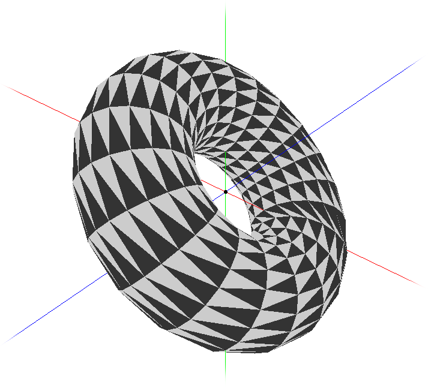
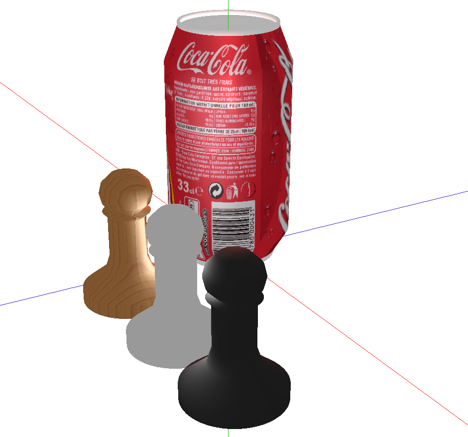

# Computer Graphics

Made for the subject 'Informática Gráfica', Universidad de Granada.

# Usage

Files can be compiled by doing `make` inside `srcs-prac`
A list of usable keys:

* <kbd>P</kbd>: changes between all the `practicax` visualizations
* <kbd>O</kbd>: changes object to visualize
* <kbd>M</kbd>: changes mode of visualization
* <kbd>G</kbd>: changes freedom degree (third assingment); changes between alpha and beta (fourth assignment)
* <kbd>\<\></kbd>: increases/decreases value of current freedom degree (third assingment); increases/decreases value of alpha/beta (fourth assignment)
* <kbd>C</kbd>: changes camera in fifth assignment.
* <kbd>V</kbd>: changes among examination and first person camera mode in fifth assignment.
* <kbd>+</kbd>: moves curent camera closer in fifth assignment
* <kbd>-</kbd>: moves away curent camera in fifth assignment
* <kbd> &leftarrow; </kbd>, <kbd> &uparrow; </kbd>, <kbd> &downarrow; </kbd>, <kbd> &rightarrow; </kbd>: moves current camera in that direction in fifth assignment

# Dependencies

* `g++`
* `freeglut3-dev`
* `libglew-dev`
* `libjpeg-dev`
